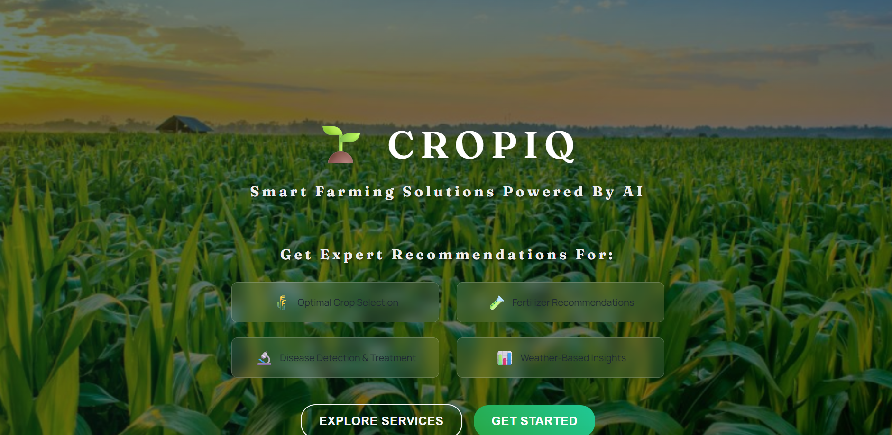
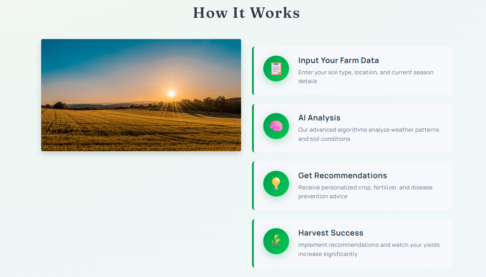
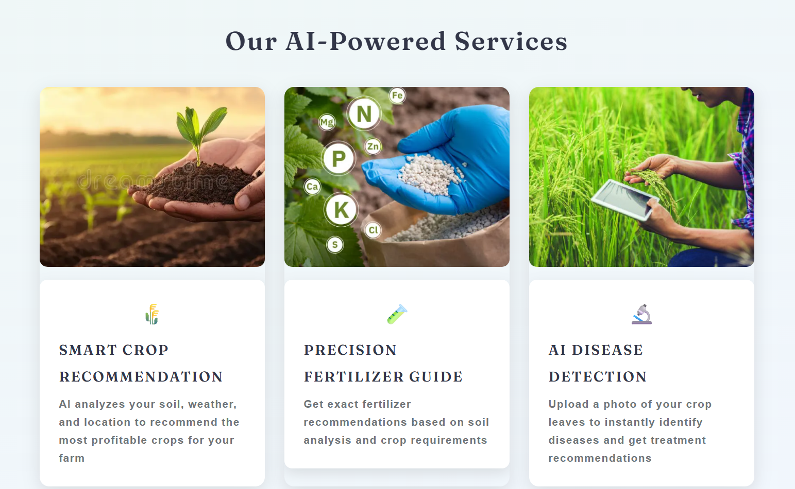

# 🌿 CropIQ — Smart Farming Powered by AI


> **CropIQ** is an AI-powered precision farming web application that helps farmers make smarter decisions using Machine Learning and Deep Learning — from choosing the right crop to detecting plant diseases.

---

## 🖼️ Screenshots

### 🏠 Home Page


### 🌾 How It Works


### 🧪 Our Services


---

## ✨ Features

| Feature | Description |
|--------|-------------|
| 🌾 **Crop Recommendation** | Enter soil NPK values + location → get the best crop to grow |
| 🧪 **Fertilizer Suggestion** | Input soil data + crop type → get fertilizer recommendations |
| 🔬 **Disease Detection** | Upload a leaf image → identify the disease + get treatment advice |
| 🌤️ **Live Weather Integration** | Auto-fetches temperature & humidity using OpenWeatherMap API |
| 📍 **GPS Location Support** | Auto-detect your location for weather and soil data |
| 🌐 **Hindi Language Support** | Full Hindi translation support for rural farmers |

---


## 🛠️ Tech Stack

**Frontend:** HTML5, CSS3, JavaScript, Bootstrap  
**Backend:** Python, Flask  
**ML/DL:** scikit-learn, PyTorch, torchvision  
**Data:** NumPy, Pandas  
**APIs:** OpenWeatherMap, SoilGrids, Nominatim

---

## 📊 Data Sources

- [Crop Recommendation Dataset](https://www.kaggle.com/atharvaingle/crop-recommendation-dataset)
- [Fertilizer Suggestion Dataset](https://github.com/Gladiator07/Harvestify/blob/master/Data-processed/fertilizer.csv)
- [Plant Disease Detection Dataset](https://www.kaggle.com/vipoooool/new-plant-diseases-dataset)

---

## ⚙️ How to Run Locally

### 1. Clone the repository
```bash
git clone https://github.com/SnehaRathi132/CROP_IQ.git
cd CROP_IQ
```

### 2. Create and activate virtual environment
```bash
python -m venv venv

# Windows
venv\Scripts\activate

# macOS/Linux
source venv/bin/activate
```

### 3. Install dependencies
```bash
pip install -r requirements.txt
```

### 4. Set your OpenWeatherMap API key *(optional but recommended)*
```bash
# Windows
set OPENWEATHER_API_KEY=your_key_here

# macOS/Linux
export OPENWEATHER_API_KEY=your_key_here
```
> Get a free API key at [openweathermap.org](https://openweathermap.org/api)

### 5. Run the application
```bash
python app/app.py
```

### 6. Open in browser
```
http://localhost:5000
```

---

## API Endpoints
- `GET /api/weather?lat=...&lon=...` or `GET /api/weather?city=...` for live weather (server-side key)
- `POST /api/crop` with JSON: `nitrogen`, `phosphorous`, `pottasium`, `ph`, `rainfall`, plus either `city` or `temperature` + `humidity`
- `POST /api/fertilizer` with JSON: `nitrogen`, `phosphorous`, `pottasium`, `moisture`, `soil_type`, `crop_type`, plus either `city` or `temperature` + `humidity`
---

## 🧠 ML Models

| Model | Algorithm | Purpose |
|-------|-----------|---------|
| Crop Recommendation | Random Forest | Predicts best crop from soil + weather |
| Fertilizer Suggestion | Decision Tree | Recommends fertilizer based on soil deficit |
| Disease Detection | ResNet9 (PyTorch) | Classifies 38 plant disease categories |

---

## 🌱 Supported Crops for Disease Detection

<details>
<summary>Click to expand</summary>

- 🍎 Apple
- 🫐 Blueberry  
- 🍒 Cherry
- 🌽 Corn (Maize)
- 🍇 Grape
- 🍊 Orange
- 🍑 Peach
- 🫑 Pepper
- 🥔 Potato
- 🫘 Soybean
- 🍓 Strawberry
- 🍅 Tomato
- 🎃 Squash
- 🫐 Raspberry

</details>

---

## 📁 Project Structure
```
CROP_IQ/
├── app/
│   ├── app.py              # Main Flask application
│   ├── config.py           # Configuration & API keys
│   ├── models/             # Trained ML models (.joblib, .pth)
│   ├── Data/               # Fertilizer CSV data
│   ├── templates/          # HTML templates
│   ├── static/             # CSS, JS, images
│   └── utils/              # Helper modules
├── archive/                # Raw datasets
├── reports/                # EDA summaries
├── requirements.txt
└── README.md
```

---

<p align="center"></p>
